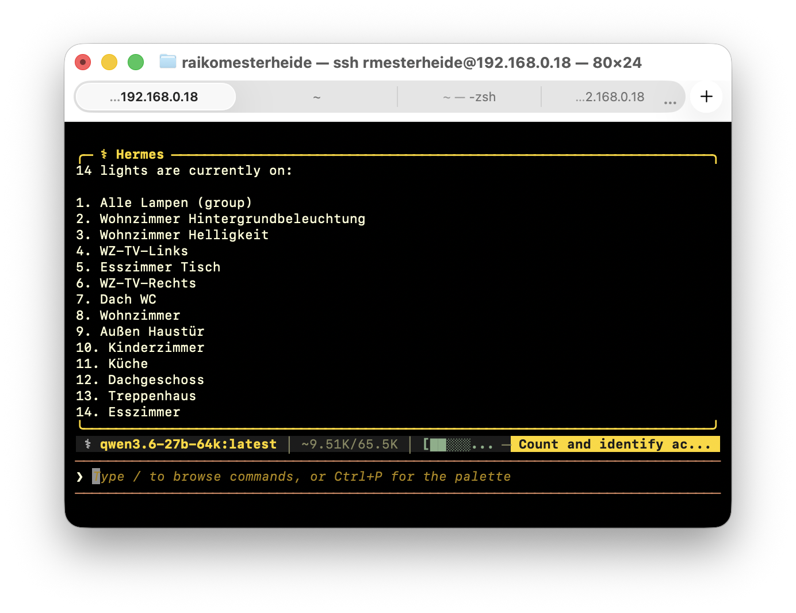
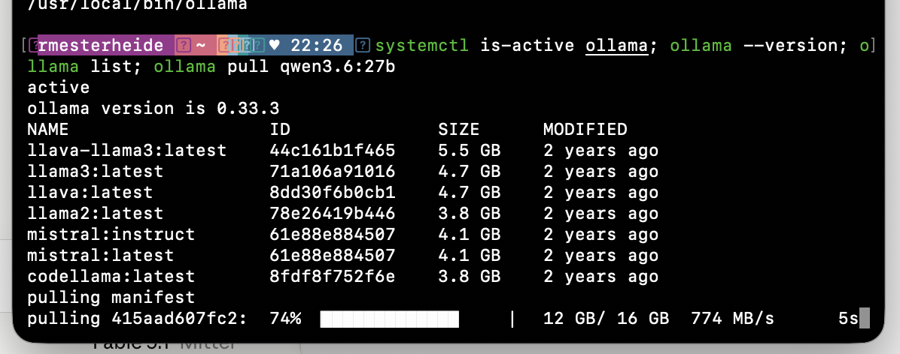
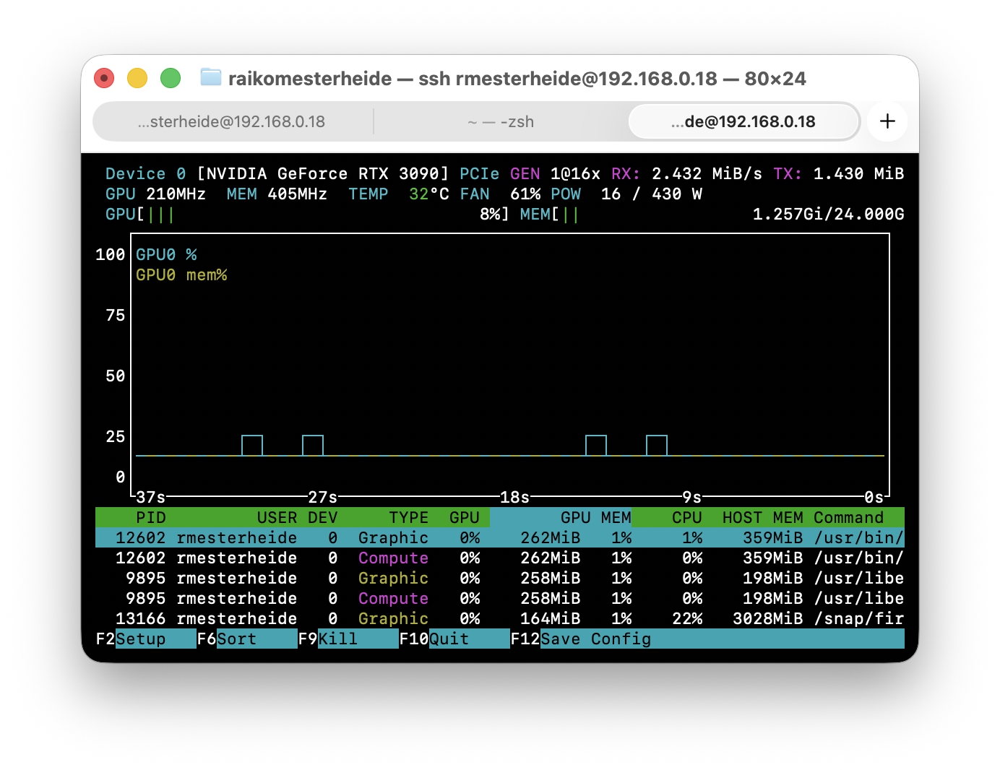
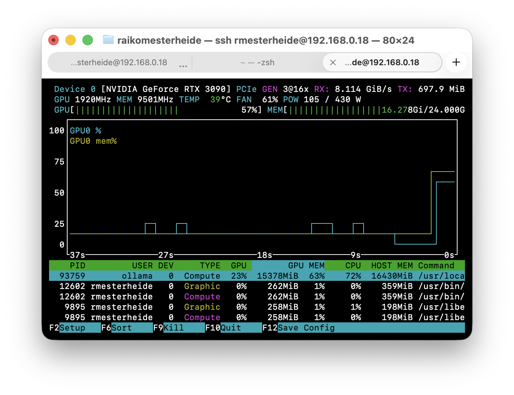
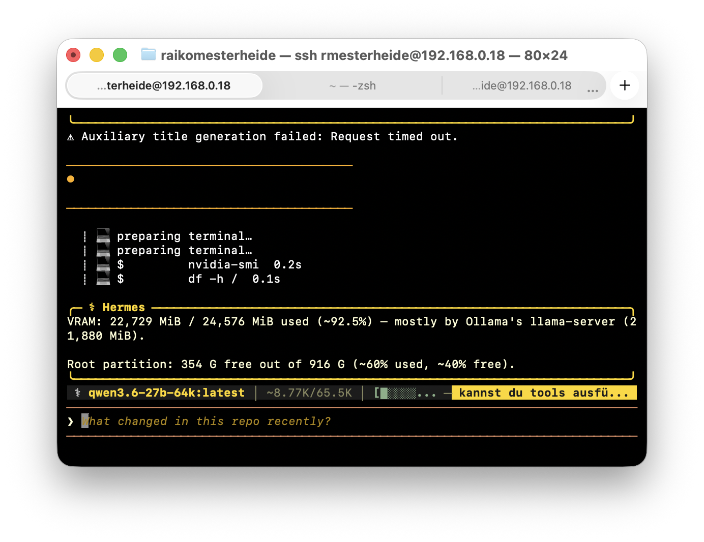
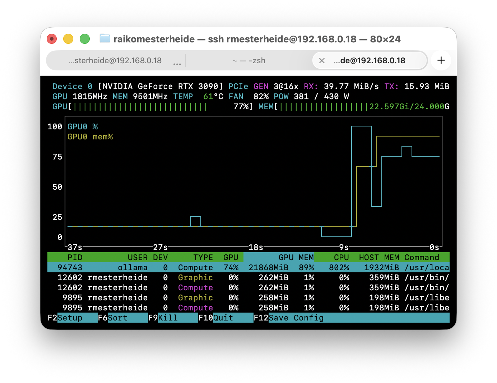
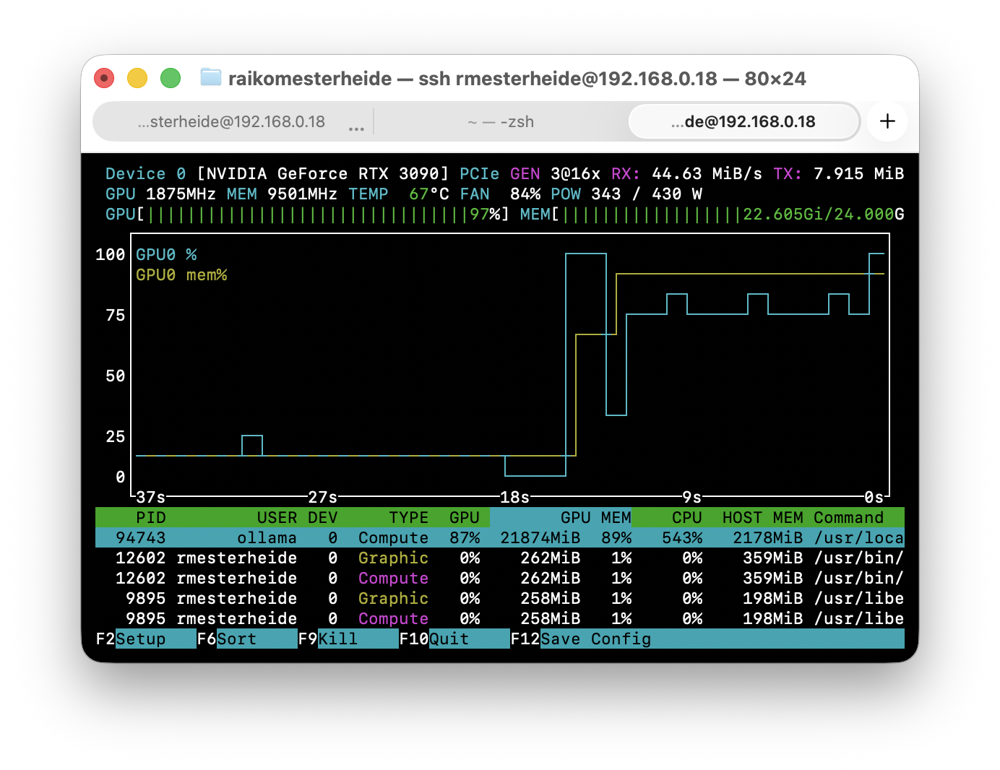
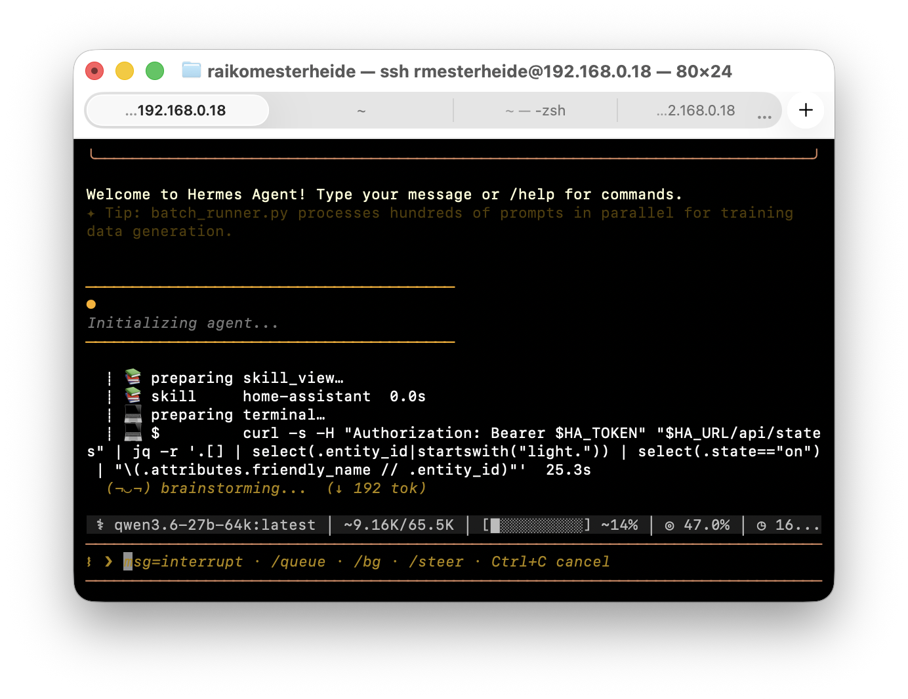

# Hermes Agent on an RTX 3090 — fully local, talking to Home Assistant

A walkthrough of getting [Hermes Agent](https://hermes-agent.nousresearch.com/) (Nous Research's open-source agent framework) running on a home server with a single 24 GB GPU, backed by a local model via Ollama, and giving it a first real job: querying a Home Assistant instance. No cloud API, no tokens leaving the LAN.

Written while doing it, on a Friday evening, with the stumbling blocks left in on purpose.



## What you need

| | This setup |
|---|---|
| GPU | NVIDIA RTX 3090, 24 GB |
| OS | Ubuntu 24.04 LTS, NVIDIA driver 570 |
| Disk | ~20 GB free for one model (more if you keep several) |
| Client | a Mac with SSH; everything below runs on the server |
| Optional | a Home Assistant instance on the same network |

Prerequisites on the server: `git`, `curl`, `xz-utils`, `jq`. Check with `which git curl xz jq`.

## 1. Baseline

Before touching anything, capture what you have. This is also what you'll paste into a bug report later.

```bash
hostname && lsb_release -ds && nvidia-smi --query-gpu=name,memory.total,driver_version --format=csv \
  && df -h / | tail -1 && python3 --version && which git curl xz docker ollama
```

In my case Ollama was already installed (two years old, with equally old Llama 2/3 and Mistral models). If `which ollama` prints nothing, the next step installs it.

## 2. Ollama: install or update, then pull the model

The same script installs and updates. Existing models are kept.

```bash
curl -fsSL https://ollama.com/install.sh | sh
ollama --version && systemctl is-active ollama
```

**Model choice.** Hermes needs reliable tool calling. Ollama's own Hermes guide recommends `qwen3.6` for 24 GB cards. The 27B dense variant is 18 GB on disk and leaves room for a large context window; the 35B MoE variant (23 GB) is faster per token but does not fit with 64k context on a 24 GB card.

```bash
ollama pull qwen3.6:27b
```



**Context window.** Ollama defaults to 2048 tokens. Hermes' system prompt with tools and skills alone is ~8k, and agentic work wants 64k. Bake it into a model variant with the [Modelfile](ollama/Modelfile):

```bash
ollama create qwen3.6-27b-64k -f ollama/Modelfile
ollama run qwen3.6-27b-64k "Answer in one sentence: who are you?"
nvidia-smi --query-gpu=memory.used --format=csv
```

Expect ~22.6 GB used with the model loaded. That is ~2 GB of headroom, so nothing else should share the GPU. Drop `num_ctx` to 32768 if you need room.

| Idle | Loading | Loaded (64k ctx) |
|---|---|---|
|  |  |  |

`nvtop` (`sudo apt install nvtop`) is the tool for these graphs. `watch -n1 nvidia-smi` works if you can't install packages.

## 3. Install Hermes Agent

One line. The installer brings its own Python 3.11 (via uv), Node, ripgrep, ffmpeg and a headless Chromium for the browser tools.

```bash
curl -fsSL https://hermes-agent.nousresearch.com/install.sh | bash
```

At the end it starts a setup wizard. The choices that matter for a local setup:

| Prompt | Choice | Why |
|---|---|---|
| How would you like to set up Hermes? | **Full setup** | "Quick Setup" routes you to the Nous Portal (cloud). |
| Provider | **Custom endpoint** (OpenAI-compatible) | Ollama speaks the OpenAI API. |
| Base URL | `http://localhost:11434/v1` | |
| API key | leave empty | |
| Model | `qwen3.6-27b-64k` | the variant with the bigger context |
| Context length | leave blank | auto-detect |
| Terminal backend | **Keep current (local)** | commands run directly on the server; Docker is the safer option for later |

Everything else (messaging integrations, extra tools) can stay on defaults. Then:

```bash
source ~/.zshrc   # or ~/.bashrc
hermes doctor
grep -A6 '^model:' ~/.hermes/config.yaml
hermes
```

`hermes doctor` will complain that the cloud providers are not logged in. That's fine — we don't use them.

## 4. First tool call

Ask something that can only be answered by running a command:

> Run nvidia-smi and df -h / and tell me how much VRAM is in use and how much space is free on the root partition.



Hermes ran both commands (0.2 s and 0.1 s) and summarised correctly. The GPU graph shows what the model is doing while it "thinks":

| Prompt processing | Generation |
|---|---|
|  |  |

Note the first turn in a fresh session is slow: the ~8k-token system prompt has to go through the GPU once, and Qwen 3.6 reasons before answering. Follow-up turns reuse the KV cache and are noticeably faster.

## 5. Give it a job: Home Assistant

Hermes skills are Markdown files with a bit of frontmatter. The one in [`skills/home-assistant/SKILL.md`](skills/home-assistant/SKILL.md) teaches the agent to use the Home Assistant REST API via `curl` + `jq`, and sets rules (read before write, never touch locks/alarms/climate without confirmation).

**Secrets never reach the model.** Variables declared in the skill's `required_environment_variables` are read from `~/.hermes/.env` and injected only into the shell the tool runs in.

1. In Home Assistant: Profile → Security → *Create long-lived access token*, name it `hermes`.
2. On the server, append to `~/.hermes/.env` (use the IP, not `homeassistant.local` — see troubleshooting):

   ```bash
   cat >> ~/.hermes/.env << 'EOF'
   HA_URL=http://192.168.0.199:8123
   HA_TOKEN=<paste token here>
   EOF
   chmod 600 ~/.hermes/.env
   ```

3. Copy the skill over (from your workstation):

   ```bash
   scp -r skills/home-assistant user@server:~/.hermes/skills/
   ```

4. Verify URL, token and skill before involving the model:

   ```bash
   set -a; source ~/.hermes/.env; set +a
   curl -s -H "Authorization: Bearer $HA_TOKEN" "$HA_URL/api/"   # -> {"message":"API running."}
   hermes skills list | grep home-assistant                       # -> home-assistant  local  enabled
   ```

5. `hermes`, then: *How many and which lights are on?*

| Skill loaded, curl composed | Result |
|---|---|
|  |  |

The model picked up the skill on its own, built the `jq` filter from the examples, and answered in under a minute. It also counted a light *group* and a brightness helper as lights — the `light.` prefix is not the whole truth. Filtering groups by their `entity_id` attribute is the obvious next iteration.

## Troubleshooting — things that actually went wrong

**Hermes ignores the skill and starts searching the filesystem for a smart-home system.** It spent 82 s running `find` and `systemctl` before asking where Home Assistant lives. Cause: `$HA_TOKEN` was empty. The token had been pasted into `.env` on its own line, without the `HA_TOKEN=` prefix — zsh even hinted at it with `command not found: eyJhbG...`. Fix: `grep '^HA_' ~/.hermes/.env` must show two lines with `KEY=value`. Verify with the `curl` above (a `401 Unauthorized` means the token is wrong or missing) *before* starting the agent.

**`Could not resolve host: homeassistant.local`.** mDNS names resolve on a Mac out of the box, on an Ubuntu server only with avahi running. Use the IP; `ping -c1 homeassistant.local` on the Mac shows it.

**`Auxiliary title generation failed: Request timed out.`** Hermes makes a second, small model call to name the session. Ollama serves one request at a time by default, so it queues behind the main answer and times out. Harmless. To make it go away: `HERMES_API_TIMEOUT=600` in `~/.hermes/.env`, or `OLLAMA_NUM_PARALLEL=2` in the Ollama service environment.

**Two identical shell prompts, one local, one SSH — and commands ending up on the wrong machine.** Happened three times in one evening (an `scp` from the server to itself, a diagnosis run on the Mac). Cheapest fix is a loud tag on the remote prompt, appended after the theme has loaded:

```bash
echo 'PROMPT="%F{red}%B[3090]%b%f $PROMPT"' >> ~/.zshrc && exec zsh
```

**Duplicate keys in `.env` after a second `cat >>`.** Dedupe with `awk '!seen[$0]++' ~/.hermes/.env > /tmp/e && mv /tmp/e ~/.hermes/.env && chmod 600 ~/.hermes/.env`.

**Tokens in the terminal scrollback.** Run `clear` before taking screenshots for a write-up like this one. None of the images here contain the token — only the `$HA_TOKEN` variable name.

## What's next

- Compare with an RTX 4090 in a second machine (see [docs/benchmarks.md](docs/benchmarks.md)).
- Second iteration of the skill: exclude groups and helpers, add `turn_on`/`turn_off` with confirmation.
- Try the 35B MoE variant with a 32k context for speed.
- Move the terminal backend to Docker before giving the agent write access to anything that matters.

## Layout

```
├── README.md                 this walkthrough
├── ollama/Modelfile          64k-context variant of qwen3.6:27b
├── skills/home-assistant/    Hermes skill (SKILL.md)
├── docs/benchmarks.md        3090 vs 4090 table, to be filled
└── docs/images/              screenshots, numbered in order of appearance
```

## Sources

- [Hermes Agent — Installation](https://hermes-agent.nousresearch.com/docs/getting-started/installation)
- [Hermes Agent — Run locally with Ollama](https://hermes-agent.nousresearch.com/docs/guides/local-ollama-setup)
- [Hermes Agent — Creating skills](https://hermes-agent.nousresearch.com/docs/developer-guide/creating-skills)
- [Ollama — Hermes integration](https://docs.ollama.com/integrations/hermes)
- [Ollama library — qwen3.6](https://ollama.com/library/qwen3.6)
